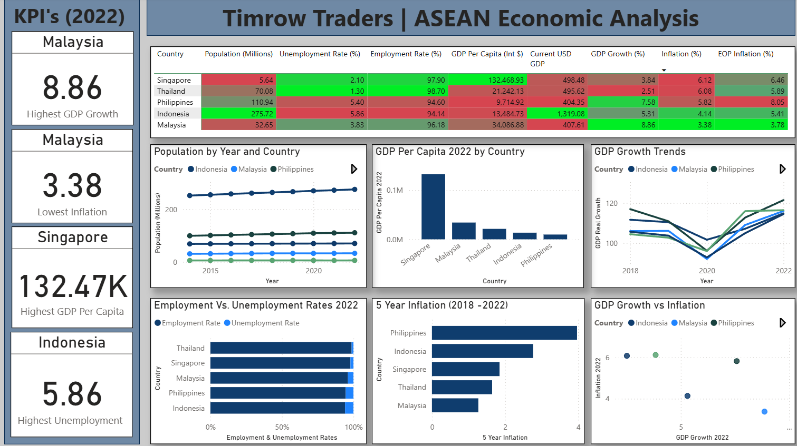

# Hello!

I’m a student at George Mason University majoring in Business with a concentration in Management of Information Systems, and minoring in Computational and Data Science. I’m passionate about turning raw data into strategic insights that drive better business decisions.

My skill set includes using Python and SQL for in-depth data analysis and actionable insights. I’ve also built a strong foundation in data visualization, with experience using both Power BI and Tableau to create clear, impactful dashboards that communicate complex stories effectively.

I hold the AWS Certified Cloud Practitioner (CCP) certification, which has strengthened my understanding of cloud fundamentals and how cloud technologies support scalable, data-driven solutions. As I continue into a new academic year, I’m excited to expand my knowledge in areas like data warehousing and big data technologies (Hadoop, Spark, Kafka) through my CDS coursework.

Thanks for visiting my portfolio—I’m excited to share my projects and growth with you!

---

## Certifications
- **Cloud & Infrastructure:** AWS (Certified Cloud Practitioner) 
- **Information Security:** CompTIA Security+

---
  
## Technical Skills

- **Programming & Data Analysis:** Python (NumPy, Pandas, Matplotlib, Seaborn), SQL, R
- **Data Visualization:** Power BI, Tableau  
- **Data Tools:** Jupyter Notebook, JupyterLab, PyCharm, VSCode  
- **Cloud & Infrastructure:** AWS (Certified Cloud Practitioner), Azure  
- **Productivity Tools:** MS Office (Excel, Word, PowerPoint)

---

## Professional Skills

- Critical Thinking & Problem Solving  
- Informed Decision Making  
- Team Collaboration  
- Detail Oriented  
- Adaptability & Flexibility  
- Customer Service  
- Strong Communication Skills  
- Action-Oriented Mindset  

---

## Projects

---

### ASEAN Economic Analysis for Market Expansion

Tools & Skills: Python (Pandas), SQL Server, Power BI, Data Cleaning, Economic Research, Market Analysis, Dashboard Design

This project supported Timrow Traders’ international expansion strategy by analyzing 10 years of macroeconomic data across ASEAN countries. Using data from the IMF World Economic Outlook, it assessed key indicators like GDP, inflation, unemployment, and population trends to identify the most viable markets. The analysis concluded that Malaysia, Philippines, and Indonesia offer the strongest potential for growth, labor availability, and economic stability.

🔗 [View Repository](https://github.com/atimilse/EconomicAnalysis)

---

### Coffee Consumption Analysis by Demographics and Lifestyle

Tools & Skills: Python (Pandas), Tableau, Data Cleaning, Survey Analysis, Data Visualization, Consumer Behavior Insights

This project analyzes coffee consumption patterns across age, gender, work environments, and employment status using survey data from the Great American Coffee Taste Test. Insights from the analysis help identify key consumer segments and provide strategic recommendations for product development and targeted marketing in the coffee industry.

🔗 [View Repository](https://github.com/atimilse/CoffeeDataAnalysis)

---

